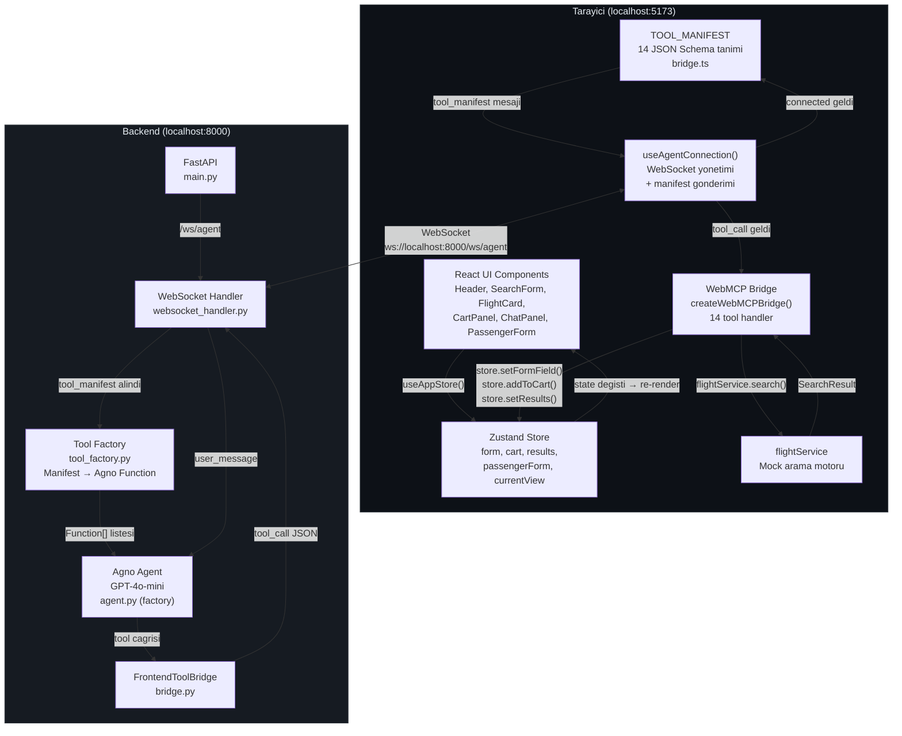
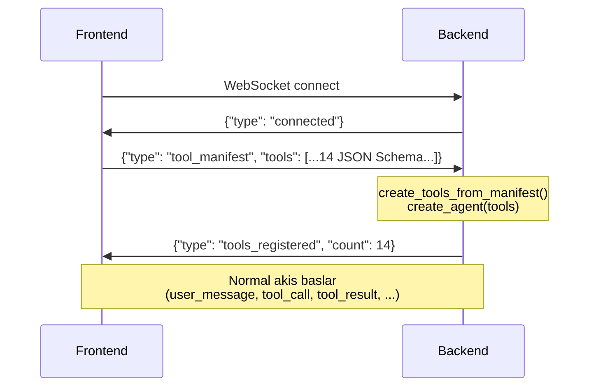
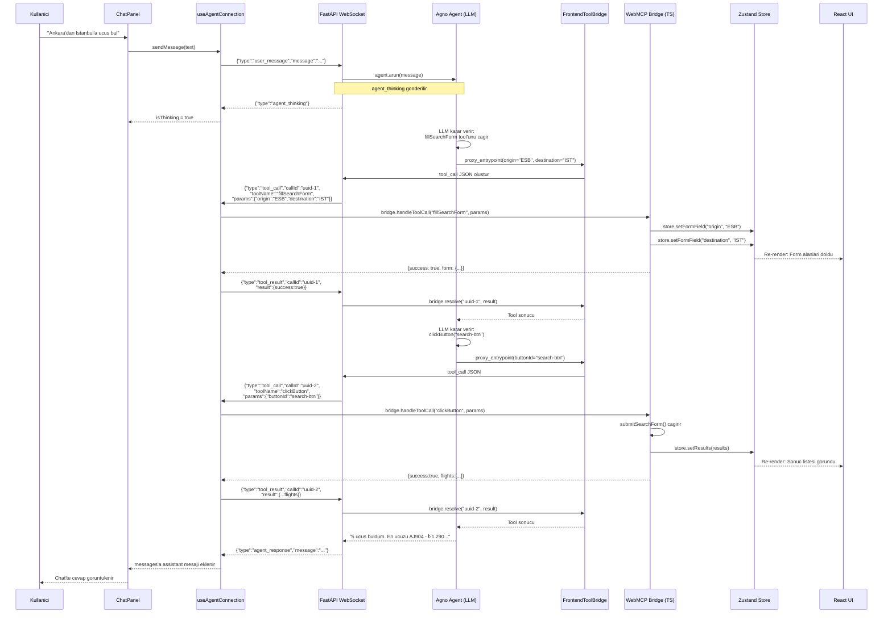
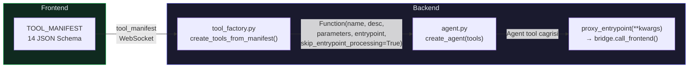
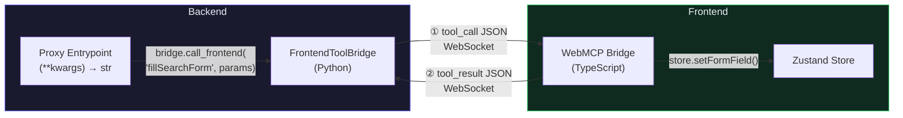
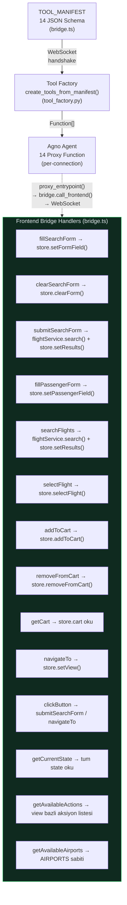
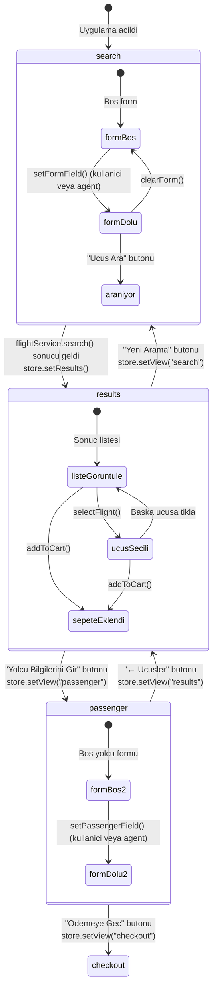

# SARP WebMCP Demo - Mimari Dokuman

## Konsept

WebMCP, bir AI agent'in frontend uygulamanin fonksiyonlarini **DOM'a dokunmadan**, tarayici icinde calisan tool handler'lar uzerinden kontrol etmesini saglayan bir mimaridir. Agent, LLM karar mekanizmasiyla hangi tool'u cagirdigini belirler; tool cagrilari WebSocket uzerinden frontend'e iletilir; frontend kendi store'unu guncelleyerek UI'i render eder; sonucu geri gonderir.

**Frontend tek kaynak (source of truth)**: Tool tanimlari frontend'de JSON Schema olarak tutulur. Backend'de statik tool kodu yoktur — agent, frontend'in gonderdigi manifest'ten dinamik olarak olusturulur.

Google'in onerdigi WebMCP standardinin custom WebSocket implementasyonu.

---

## Sistem Mimarisi (Mermaid)



---

## WebSocket Handshake Akisi

Frontend baglandiginda, agent olusturulmadan once tool manifest degis-tokus edilir:



Bu sayede:
- Frontend'e yeni tool eklendiginde backend kodu degismez
- Agent, her baglantida frontend'in sundugu tool'larla olusturulur
- Backend'de statik tool dosyalari yoktur

---

## Mesaj Akis Diyagrami (Mermaid)

Kullanicinin "Ankara'dan Istanbul'a ucus bul" yazmasi senaryosu:



---

## Katmanlar Arasi Iletisim Detayi

Asagidaki diyagram, her katmanin birbirine **ne gonderdigi** ve **ne aldigi**ni gosterir:

```
┌─────────────────────────────────────────────────────────────────────────────────┐
│                              TARAYICI (React)                                   │
│                                                                                 │
│  ┌──────────┐    ┌──────────────────┐    ┌──────────────────┐    ┌───────────┐  │
│  │ ChatPanel│───>│useAgentConnection│───>│  WebMCP Bridge   │───>│  Zustand  │  │
│  │          │    │                  │    │                  │    │  Store    │  │
│  │  Mesaj   │    │  WS baglantisi   │    │  Tool handler'lar│    │           │  │
│  │  gonder  │    │  yonetir         │    │  calistirir      │    │  State    │  │
│  │          │    │  + tool_manifest │    │                  │    │  gunceller│  │
│  │          │    │    gonderir      │    │  TOOL_MANIFEST   │    │           │  │
│  └──────────┘    └────────┬─────────┘    │  JSON Schema x14 │    └─────┬─────┘  │ 
│                           │              └──────────────────┘          │        │
│                           │ WebSocket                                  │ re-    │
│                           │                                            │ render │
│                           │                                            ▼        │
│                           │                                    ┌───────────┐    │
│                           │                                    │    UI     │    │
│                           │                                    │Components │    │
│                           │                                    └───────────┘    │
└───────────────────────────┼─────────────────────────────────────────────────────┘
                            │
              ══════════════╪══════════════  WebSocket (ws://localhost:8000/ws/agent)
                            │
┌───────────────────────────┼─────────────────────────────────────────────────────┐
│                     BACKEND (Python)                                             │
│                           │                                                     │
│  ┌────────────────────────┴────────────────────┐                                │
│  │         WebSocket Handler                    │                                │
│  │         websocket_handler.py                 │                                │
│  │                                              │                                │
│  │  - tool_manifest → Tool Factory + Agent      │                                │
│  │  - user_message  → Agent'a ilet              │                                │
│  │  - tool_result   → Bridge'e resolve et       │                                │
│  │  - user_action   → Agent'a context olarak    │                                │
│  └─────────┬──────────────────────┬─────────────┘                                │
│            │                      │                                              │
│  ┌─────────┴───────────┐  ┌──────┴───────────────────┐                          │
│  │ Tool Factory         │  │  FrontendToolBridge      │                          │
│  │ tool_factory.py      │  │  bridge.py               │                          │
│  │                      │  │                          │                          │
│  │ Manifest → Agno      │  │  call_frontend()         │                          │
│  │ Function proxy'leri  │  │  - JSON olustur          │                          │
│  │                      │  │  - WS'den gonder         │                          │
│  │ skip_entrypoint_     │  │  - Future ile bekle      │                          │
│  │ processing=True      │  │  - Sonucu don            │                          │
│  └─────────┬────────────┘  └─────────────────────────┘                          │
│            │                      ▲                                              │
│  ┌─────────┴───────────┐         │                                              │
│  │   Agno Agent         │─────────┘                                              │
│  │   agent.py (factory) │  Her tool cagrisi                                      │
│  │                      │  proxy_entrypoint() →                                  │
│  │   GPT-4o-mini LLM   │  bridge.call_frontend()                                │
│  │   Per-connection     │                                                        │
│  │   Turkce instruction │                                                        │
│  └──────────────────────┘                                                        │
└──────────────────────────────────────────────────────────────────────────────────┘
```

---

## Dinamik Tool Factory Mimarisi

Backend'de statik tool dosyalari yoktur. Tum tool'lar frontend manifest'inden dinamik olarak olusturulur:



**Proxy entrypoint pattern**:

```python
# tool_factory.py
def create_proxy_tool(entry):
    tool_name = entry["name"]

    async def proxy_entrypoint(**kwargs) -> str:
        result = await bridge.call_frontend(tool_name, kwargs)
        return json.dumps(result, ensure_ascii=False)

    return Function(
        name=tool_name,
        description=entry.get("description", ""),
        parameters=entry.get("parameters", {...}),
        entrypoint=proxy_entrypoint,
        skip_entrypoint_processing=True,  # JSON Schema olduğu gibi LLM'e sunulur
    )
```

`skip_entrypoint_processing=True` sayesinde proxy fonksiyonunun `**kwargs` imzasi yerine frontend'den gelen zengin JSON Schema parametreleri (enum, description, required) LLM'e sunulur.

---

## WebSocket Mesaj Protokolu

Tum iletisim JSON formatinda, tek bir WebSocket kanali uzerinden gerceklesir.

### Backend → Frontend

| type | Aciklama | Ek alanlar |
|------|----------|------------|
| `connected` | Baglanti kuruldu, manifest bekleniyor | - |
| `tools_registered` | Manifest islendi, agent hazir | `count: number` |
| `tool_call` | Agent bir tool cagirdi | `callId`, `toolName`, `params` |
| `agent_thinking` | Agent dusunuyor | - |
| `agent_response` | Agent cevap verdi | `message: string` |
| `agent_error` | Agent hatasi | `message: string` |

### Frontend → Backend

| type | Aciklama | Ek alanlar |
|------|----------|------------|
| `tool_manifest` | Tool tanimlari (handshake) | `tools: ToolManifestEntry[]` |
| `user_message` | Kullanici mesaji | `message: string` |
| `tool_result` | Tool calisma sonucu | `callId`, `result: object` |
| `user_action` | Kullanici UI degisikligi | `changes: string[]` |

### Ornek Mesaj Akisi

```json
// 1. Backend → Frontend: Baglanti
{"type": "connected"}

// 2. Frontend → Backend: Tool manifest
{
  "type": "tool_manifest",
  "tools": [
    {
      "name": "fillSearchForm",
      "description": "Arama formunu doldurur...",
      "parameters": {
        "type": "object",
        "properties": {
          "origin": {"type": "string", "description": "Kalkis havalimani IATA kodu"},
          "destination": {"type": "string", "description": "Varis havalimani IATA kodu"}
        }
      }
    }
  ]
}

// 3. Backend → Frontend: Manifest islendi
{"type": "tools_registered", "count": 14}

// 4. Frontend → Backend: Kullanici mesaji
{"type": "user_message", "message": "Ankara'dan Istanbul'a ucus bul"}

// 5. Backend → Frontend: Agent dusunuyor
{"type": "agent_thinking"}

// 6. Backend → Frontend: Tool cagrisi
{
  "type": "tool_call",
  "callId": "550e8400-e29b-41d4-a716-446655440000",
  "toolName": "fillSearchForm",
  "params": {"origin": "ESB", "destination": "IST"}
}

// 7. Frontend → Backend: Tool sonucu
{
  "type": "tool_result",
  "callId": "550e8400-e29b-41d4-a716-446655440000",
  "result": {"success": true, "data": {"form": {"origin": "ESB", "destination": "IST"}}}
}

// 8. Backend → Frontend: Agent cevabi
{"type": "agent_response", "message": "Formu doldurdum, arama yapiyorum..."}
```

---

## Bridge Mimarisi (Mermaid)

Frontend ve backend'de **ikiz bridge** yapisi vardir. Her tool cagrisi iki bridge arasinda ping-pong yapar:



**Backend bridge** (`bridge.py`):
- `call_frontend(tool_name, params)` → JSON mesaj olusturur, WebSocket'ten gonderir, `asyncio.Future` ile sonucu bekler
- `resolve(call_id, result)` → Frontend'den gelen sonucu Future'a set eder

**Frontend bridge** (`bridge.ts`):
- `handleToolCall(name, params)` → Ilgili handler'i calistirir, store'u gunceller, sonucu doner
- Her handler dogrudan Zustand store action'larini cagirir
- `TOOL_MANIFEST` → 14 tool'un JSON Schema tanimlari (backend'e handshake'te gonderilir)

---

## Tool Haritasi (Mermaid)



Not: `setFormField` handler'i manifest'e dahil degildir — dusuk seviyeli, agent'in dogrudan kullanmasi gerekmiyor (`fillSearchForm` yeterli).

---

## Frontend Entegrasyonu

### 1. Store'a Baglanti: Component'ler Nasil State Okur

Her component Zustand'in selector pattern'ini kullanir. Store degistiginde sadece ilgili component re-render olur:

```tsx
// components/SearchForm.tsx
import { useAppStore } from '../store/useAppStore';

export function SearchForm() {
  // Sadece form state'ini dinler
  const form = useAppStore((s) => s.form);
  const setFormField = useAppStore((s) => s.setFormField);

  return (
    <select
      value={form.origin}
      onChange={(e) => setFormField('origin', e.target.value)}
    >
      {/* ... */}
    </select>
  );
}
```

### 2. Agent → Store: Tool Call Form'u Nasil Doldurur

Agent "Ankara → Istanbul formu doldur" dediginde, arka planda su zincir calisir:

```
Agent (LLM)
  → proxy_entrypoint(origin="ESB", destination="IST")        [Agno Function proxy]
    → bridge.call_frontend("fillSearchForm", {...})           [Python bridge]
      → WebSocket mesaj                                       [Ag]
        → useAgentConnection ws.onmessage                     [React hook]
          → bridge.handleToolCall("fillSearchForm", {...})    [TS bridge]
            → store.setFormField("origin", "ESB")             [Zustand]
            → store.setFormField("destination", "IST")        [Zustand]
              → SearchForm re-render (select'ler guncellenir) [React]
```

### 3. WebSocket Hook: Baglanti, Manifest ve Mesaj Yonlendirme

`useAgentConnection()` hook'u tum WebSocket yasam dongusunu yonetir:

```ts
// webmcp/useAgentConnection.ts
export function useAgentConnection() {
  const connectWS = useCallback(() => {
    const ws = new WebSocket('ws://localhost:8000/ws/agent');

    ws.onopen = () => useAppStore.getState().setConnected(true);

    ws.onclose = () => {
      useAppStore.getState().setConnected(false);
      setTimeout(connectWS, 3000); // 3sn sonra tekrar dene
    };

    ws.onmessage = async (ev) => {
      const data = JSON.parse(ev.data);

      switch (data.type) {
        case 'connected':
          // Bridge olustur + tool manifest'i backend'e gonder
          bridgeRef.current = createWebMCPBridge(useAppStore.getState());
          ws.send(JSON.stringify({ type: 'tool_manifest', tools: TOOL_MANIFEST }));
          break;

        case 'tools_registered':
          console.log(`[WebMCP] Backend registered ${data.count} tools`);
          break;

        case 'tool_call':
          // Bridge'i taze state ile olustur, tool'u calistir, sonucu geri gonder
          bridgeRef.current = createWebMCPBridge(useAppStore.getState());
          const result = await bridgeRef.current.handleToolCall(data.toolName, data.params);
          ws.send(JSON.stringify({ type: 'tool_result', callId: data.callId, result }));
          break;

        case 'agent_thinking':
          setIsThinking(true);
          break;

        case 'agent_response':
          setIsThinking(false);
          setMessages(prev => [...prev, { role: 'assistant', content: data.message }]);
          break;
      }
    };
  }, []);

  // ...
  return { messages, isThinking, sendMessage };
}
```

### 4. Field Highlight: Agent Degisikliklerini Gorsellestirme

Agent bir formu doldurunca, kullanici hangi alanlarin degistigini gorsel olarak gorur:

```ts
// App.tsx
const { hl, highlight } = useFieldHighlight();
const prevFormRef = useRef<FormState>(form);

useEffect(() => {
  (Object.keys(form) as (keyof FormState)[]).forEach((k) => {
    if (form[k] !== prevFormRef.current[k]) highlight(k);
  });
  prevFormRef.current = form;
}, [form, highlight]);
```

```ts
// hooks/useFieldHighlight.ts
export function useFieldHighlight() {
  const [hl, setHl] = useState<Record<string, boolean>>({});

  const highlight = useCallback((field: string) => {
    setHl(prev => ({ ...prev, [field]: true }));
    setTimeout(() => setHl(prev => ({ ...prev, [field]: false })), 1200);
  }, []);

  return { hl, highlight };
}
```

Sonuc: Agent "origin" alanini doldurunca, input 1.2 saniye boyunca indigo border + glow efekti gosterir.

### 5. Yeni Tool Ekleme Ornegi

Dinamik mimari sayesinde yeni tool eklemek artik **sadece frontend degisikligi** gerektirir:

**1. Frontend** - `webmcp/bridge.ts` TOOL_MANIFEST'e JSON Schema ekle:

```ts
// bridge.ts — TOOL_MANIFEST dizisine ekle
{
  name: 'getFlightDetails',
  description: 'Bir ucusun detaylarini getir',
  parameters: {
    type: 'object',
    properties: {
      offerId: { type: 'string', description: 'Ucusun offer ID\'si' },
    },
    required: ['offerId'],
  },
},
```

**2. Frontend** - `webmcp/bridge.ts` handlers'a ekle:

```ts
// bridge.ts — handlers icine ekle
getFlightDetails: async ({ offerId }) => {
  const flight = MOCK_FLIGHTS.find((f) => f.offerId === offerId);
  if (!flight) return { success: false, error: 'Ucus bulunamadi' };
  return {
    success: true,
    data: {
      flight,
      priceFormatted: `₺${flight.price.toLocaleString('tr-TR')}`,
    },
  };
},
```

**Baska hicbir degisiklik gerekmez.** Backend kodu degismez — bir sonraki WebSocket baglantisininda yeni tool otomatik olarak kesfedilir ve agent tarafindan kullanilabilir hale gelir.

### 6. Backend Bridge: Async Future Pattern

Backend'deki bridge, Agent'in tool cagrisini frontend'e iletir ve cevabi **async olarak bekler**:

```python
# bridge.py
async def call_frontend(self, tool_name: str, params: dict) -> dict:
    # 1. Benzersiz ID olustur
    call_id = str(uuid.uuid4())

    # 2. Cevap icin Future olustur
    future = asyncio.get_event_loop().create_future()
    self.pending_calls[call_id] = future

    # 3. Frontend'e tool_call gonder
    await self.websocket.send_json({
        "type": "tool_call",
        "callId": call_id,
        "toolName": tool_name,
        "params": params,
    })

    # 4. Frontend'den tool_result gelene kadar bekle (max 30sn)
    try:
        return await asyncio.wait_for(future, timeout=30.0)
    except asyncio.TimeoutError:
        return {"error": "Timeout"}

# Frontend tool_result gonderdigi zaman:
def resolve(self, call_id: str, result: dict):
    future = self.pending_calls.pop(call_id, None)
    if future and not future.done():
        future.set_result(result)  # → call_frontend() donuyor
```

Bu pattern sayesinde Agno Agent, tool sonucunu Python fonksiyon donus degeri gibi alir:

```python
# tool_factory.py — her tool icin olusturulan proxy
async def proxy_entrypoint(**kwargs) -> str:
    result = await bridge.call_frontend(tool_name, kwargs)
    return json.dumps(result, ensure_ascii=False)
```

---

## State Akis Diyagrami (Mermaid)



---

## Dosya Yapisi

```
WebMCP/
├── ARCHITECTURE.md
│
├── frontend/
│   ├── index.html
│   ├── package.json              # React 18 + Zustand + Tailwind + Vite
│   ├── vite.config.ts
│   ├── tailwind.config.js
│   ├── postcss.config.js
│   ├── tsconfig.json
│   ├── tsconfig.app.json
│   ├── tsconfig.node.json
│   └── src/
│       ├── main.tsx              # ReactDOM.createRoot entry
│       ├── App.tsx               # Layout: Header + [Sol Panel | Chat Panel]
│       ├── index.css             # Tailwind directives + dark theme globals
│       ├── vite-env.d.ts
│       │
│       ├── types/
│       │   └── index.ts          # Tum interface'ler (Flight, FormState, ToolManifestEntry, WebSocketMessage, ...)
│       │
│       ├── data/
│       │   └── constants.ts      # AIRPORTS(10), CABIN_CLASSES(3), MOCK_FLIGHTS(8)
│       │
│       ├── services/
│       │   └── flightService.ts  # Mock arama motoru (800ms gecikme)
│       │
│       ├── store/
│       │   └── useAppStore.ts    # Zustand: form, cart, results, view, isConnected + action'lar
│       │
│       ├── hooks/
│       │   └── useFieldHighlight.ts  # Agent degisikliklerini 1.2sn highlight
│       │
│       ├── webmcp/
│       │   ├── bridge.ts             # TOOL_MANIFEST (14 JSON Schema) + createWebMCPBridge() (14 handler)
│       │   └── useAgentConnection.ts # WebSocket hook: connect, manifest gonder, mesaj yonlendirme
│       │
│       └── components/
│           ├── Header.tsx        # Nav tabs + baglanti gostergesi
│           ├── SearchForm.tsx    # Kalkis/varis, tarih, kabin, yolcu, ara/temizle
│           ├── PassengerForm.tsx # Ad, soyad, email, tel, TC, dogum, cinsiyet
│           ├── FlightCard.tsx    # Ucus karti (secili/sepette highlight)
│           ├── CartPanel.tsx     # Sepet listesi + toplam
│           ├── ChatPanel.tsx     # Chat: mesajlar + input + quick-action butonlari
│           └── ChatMessage.tsx   # Mesaj balonu (user/assistant/thinking/tool)
│
├── backend/
│   ├── main.py                   # FastAPI app, CORS, /health, WS route, uvicorn
│   ├── bridge.py                 # FrontendToolBridge sinifi + global instance
│   ├── agent.py                  # create_agent(tools) factory — per-connection agent
│   ├── tool_factory.py           # Manifest → Agno Function proxy'leri (dinamik)
│   ├── websocket_handler.py      # WS endpoint: handshake + mesaj dongusu
│   └── requirements.txt
│
└── files/                        # Orijinal tek-dosya versiyonlari (arsiv)
    ├── backend-main.py
    ├── frontend-app.jsx
    └── ARCHITECTURE.md
```

---

## Calistirma

### Backend
```bash
cd backend
python -m venv .venv
source .venv/bin/activate
pip install -r requirements.txt
export OPENAI_API_KEY="sk-..."
python main.py
# → http://localhost:8000
# → GET /health → {"status":"ok","mode":"dynamic","description":"Agent created per WebSocket connection from frontend tool manifest"}
```

### Frontend
```bash
cd frontend
npm install
npm run dev
# → http://localhost:5173
```

### Dogrulama
1. Tarayicida `http://localhost:5173` ac
2. Arama formu ve chat paneli gorunmeli
3. Header'da yesil nokta: "Agent Bagli"
4. Tarayici konsolunda `[WebMCP] Backend registered 14 tools from manifest` mesaji
5. Chat'e "Ankara Istanbul formu doldur" yaz → form alanlari dolmali + highlight efekti
6. "Ara butonuna bas" yaz → sonuc listesi gorunmeli
7. "En ucuzu sepete ekle" → sepete eklenmeli
8. `npm run build` → TypeScript hatasiz build
9. `GET /health` → `{"status":"ok","mode":"dynamic",...}`

---

## Production Notlari

### Mock → Gercek API

```ts
// services/flightService.ts
export const flightService = {
  search: async (params: SearchParams): Promise<SearchResult> => {
    const res = await fetch('/api/v1/offers/search', {
      method: 'POST',
      headers: { 'Content-Type': 'application/json' },
      body: JSON.stringify(params),
    });
    return res.json();
  },
};
```

Bridge ve store kodu degismez — sadece servis katmani degisir.

### Azure OpenAI

```python
# agent.py
from agno.models.azure import AzureOpenAI

def create_agent(tools):
    return Agent(
        model=AzureOpenAI(
            id="gpt-4o",
            azure_endpoint="https://your-resource.openai.azure.com/",
            api_version="2024-02-15-preview",
        ),
        tools=tools,
        # ...geri kalan ayni
    )
```

### Google WebMCP Standardi

Gelecekte tarayici native WebMCP destegi geldiginde:

```ts
// Mevcut custom bridge yerine:
navigator.modelContext.registerTool({
  name: 'searchFlights',
  description: 'Ucus ara',
  inputSchema: { /* JSON Schema */ },
  execute: async (params) => {
    const results = await flightService.search(params);
    useAppStore.getState().setResults(results);
    return results;
  },
});
```

Transport degisir, is mantigi ayni kalir.
