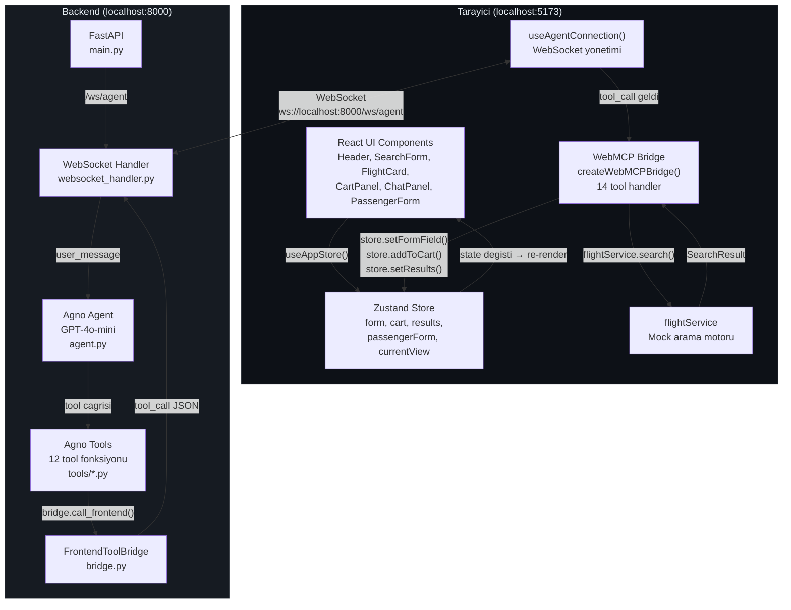
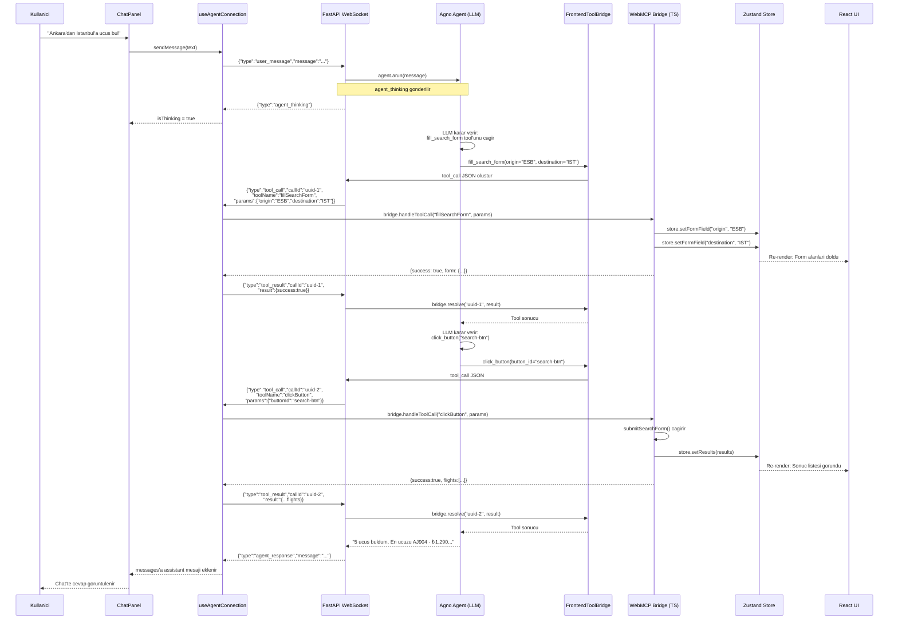
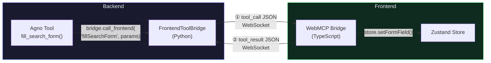
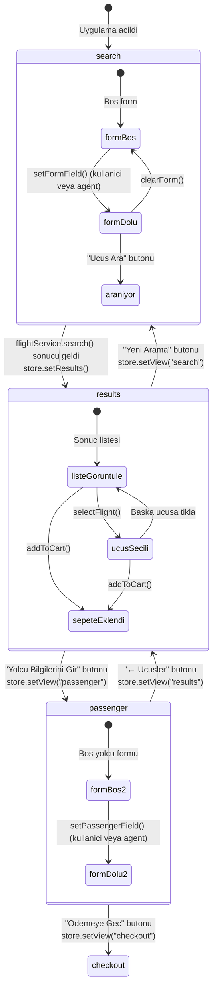

# SARP WebMCP Demo - Mimari Dokuman

## Konsept

WebMCP, bir AI agent'in frontend uygulamanin fonksiyonlarini **DOM'a dokunmadan**, tarayici icinde calisan tool handler'lar uzerinden kontrol etmesini saglayan bir mimaridir. Agent, LLM karar mekanizmasiyla hangi tool'u cagirdigini belirler; tool cagrilari WebSocket uzerinden frontend'e iletilir; frontend kendi store'unu guncelleyerek UI'i render eder; sonucu geri gonderir.

Google'in onerdi WebMCP standardinin custom WebSocket implementasyonu.

---

## Sistem Mimarisi (Mermaid)



---

## Mesaj Akis Diyagrami (Mermaid)

Kullanicinin "Ankara'dan Istanbul'a ucus bul" yazmasi senaryosu:



---

## Katmanlar Arasi Iletisim Detayi

Asagidaki diyagram, her katmanin birbirine **ne gonderdigi** ve **ne aldigi**ni gosterir:

```
┌─────────────────────────────────────────────────────────────────────────────────┐
│                              TARAYICI (React)                                   │
│                                                                                 │
│  ┌──────────┐    ┌──────────────────┐    ┌──────────────────┐    ┌───────────┐ │
│  │  ChatPanel│───>│useAgentConnection│───>│  WebMCP Bridge   │───>│  Zustand   │ │
│  │          │    │                  │    │                  │    │  Store     │ │
│  │  Mesaj   │    │  WS baglantisi   │    │  Tool handler'lar│    │           │ │
│  │  gonder  │    │  yonetir         │    │  calistirir      │    │  State    │ │
│  │          │    │                  │    │                  │    │  gunceller │ │
│  └──────────┘    └────────┬─────────┘    └──────────────────┘    └─────┬─────┘ │
│                           │                                           │        │
│                           │ WebSocket                                 │ re-    │
│                           │                                           │ render │
│                           │                                           ▼        │
│                           │                                    ┌───────────┐   │
│                           │                                    │    UI     │   │
│                           │                                    │Components │   │
│                           │                                    └───────────┘   │
└───────────────────────────┼─────────────────────────────────────────────────────┘
                            │
              ══════════════╪══════════════  WebSocket (ws://localhost:8000/ws/agent)
                            │
┌───────────────────────────┼─────────────────────────────────────────────────────┐
│                     BACKEND (Python)                                             │
│                           │                                                     │
│  ┌────────────────────────┴────────────────────┐                                │
│  │         WebSocket Handler                    │                                │
│  │         websocket_handler.py                 │                                │
│  │                                              │                                │
│  │  - user_message → Agent'a ilet              │                                │
│  │  - tool_result  → Bridge'e resolve et       │                                │
│  │  - tool_call    → Frontend'e gonder (bridge)│                                │
│  └──────────────┬───────────────────────────────┘                                │
│                 │                                                                │
│     ┌───────────┴───────────┐         ┌────────────────────────┐                │
│     │   Agno Agent          │────────>│  FrontendToolBridge    │                │
│     │   agent.py            │         │  bridge.py             │                │
│     │                       │         │                        │                │
│     │   GPT-4o-mini LLM    │         │  call_frontend()       │                │
│     │   12 tool tanimi      │         │  - JSON olustur        │                │
│     │   Turkce instruction  │         │  - WS'den gonder       │                │
│     │                       │         │  - Future ile bekle    │                │
│     └───────────────────────┘         │  - Sonucu don          │                │
│               │                       └────────────────────────┘                │
│               │ Tool cagrilari                                                  │
│     ┌─────────┴─────────────────────────────────────────────┐                   │
│     │                    tools/                              │                   │
│     │  ┌──────────────┐ ┌──────────────┐ ┌──────────────┐  │                   │
│     │  │ form_tools   │ │flight_tools  │ │passenger_    │  │                   │
│     │  │              │ │              │ │tools         │  │                   │
│     │  │fill_search   │ │search_flights│ │              │  │                   │
│     │  │clear_search  │ │select_flight │ │fill_passenger│  │                   │
│     │  │click_button  │ │add_to_cart   │ │_form         │  │                   │
│     │  │              │ │remove_cart   │ │              │  │                   │
│     │  │              │ │get_cart      │ └──────────────┘  │                   │
│     │  └──────────────┘ └──────────────┘                    │                   │
│     │  ┌──────────────┐                                     │                   │
│     │  │navigation_   │  Her tool: bridge.call_frontend()   │                   │
│     │  │tools         │  ile frontend'e delege eder         │                   │
│     │  │              │                                     │                   │
│     │  │navigate_to   │                                     │                   │
│     │  │get_state     │                                     │                   │
│     │  │get_airports  │                                     │                   │
│     │  └──────────────┘                                     │                   │
│     └───────────────────────────────────────────────────────┘                   │
└─────────────────────────────────────────────────────────────────────────────────┘
```

---

## WebSocket Mesaj Protokolu

Tum iletisim JSON formatinda, tek bir WebSocket kanali uzerinden gerceklesir.

### Backend → Frontend

| type | Aciklama | Ek alanlar |
|------|----------|------------|
| `connected` | Baglanti kuruldu, tool listesi | `tools: ToolDefinition[]` |
| `tool_call` | Agent bir tool cagirdi | `callId`, `toolName`, `params` |
| `agent_thinking` | Agent dusunuyor | - |
| `agent_response` | Agent cevap verdi | `message: string` |
| `agent_error` | Agent hatasi | `message: string` |

### Frontend → Backend

| type | Aciklama | Ek alanlar |
|------|----------|------------|
| `user_message` | Kullanici mesaji | `message: string` |
| `tool_result` | Tool calisma sonucu | `callId`, `result: object` |

### Ornek Mesaj Akisi

```json
// 1. Backend → Frontend: Baglanti
{"type": "connected", "tools": [{"name": "fillSearchForm", ...}, ...]}

// 2. Frontend → Backend: Kullanici mesaji
{"type": "user_message", "message": "Ankara'dan Istanbul'a ucus bul"}

// 3. Backend → Frontend: Agent dusunuyor
{"type": "agent_thinking"}

// 4. Backend → Frontend: Tool cagrisi
{
  "type": "tool_call",
  "callId": "550e8400-e29b-41d4-a716-446655440000",
  "toolName": "fillSearchForm",
  "params": {"origin": "ESB", "destination": "IST"}
}

// 5. Frontend → Backend: Tool sonucu
{
  "type": "tool_result",
  "callId": "550e8400-e29b-41d4-a716-446655440000",
  "result": {"success": true, "form": {"origin": "ESB", "destination": "IST", ...}}
}

// 6. Backend → Frontend: Agent cevabi
{"type": "agent_response", "message": "Formu doldurdum, arama yapiyorum..."}
```

---

## Bridge Mimarisi (Mermaid)

Frontend ve backend'de **ikiz bridge** yapisi vardir. Her tool cagrisi iki bridge arasinda ping-pong yapar:



**Backend bridge** (`bridge.py`):
- `call_frontend(tool_name, params)` → JSON mesaj olusturur, WebSocket'ten gonderir, `asyncio.Future` ile sonucu bekler
- `resolve(call_id, result)` → Frontend'den gelen sonucu Future'a set eder

**Frontend bridge** (`bridge.ts`):
- `handleToolCall(name, params)` → Ilgili handler'i calistirir, store'u gunceller, sonucu doner
- Her handler dogrudan Zustand store action'larini cagirir

---

## Tool Haritasi (Mermaid)

```mermaid
graph TD
    Agent["Agno Agent<br/>12 Tool"]

    subgraph FormTools["form_tools.py"]
        T1["fill_search_form"]
        T2["clear_search_form"]
        T3["click_button"]
    end

    subgraph FlightTools["flight_tools.py"]
        T4["search_flights"]
        T5["select_flight"]
        T6["add_to_cart"]
        T7["remove_from_cart"]
        T8["get_cart"]
    end

    subgraph PassengerTools["passenger_tools.py"]
        T9["fill_passenger_form"]
    end

    subgraph NavTools["navigation_tools.py"]
        T10["navigate_to"]
        T11["get_current_state"]
        T12["get_available_airports"]
    end

    Agent --> FormTools
    Agent --> FlightTools
    Agent --> PassengerTools
    Agent --> NavTools

    subgraph FrontendHandlers["Frontend Bridge Handlers"]
        H1["fillSearchForm → store.setFormField()"]
        H2["clearSearchForm → store.clearForm()"]
        H3["clickButton → submitSearchForm / navigateTo"]
        H4["searchFlights → flightService.search() + store.setResults()"]
        H5["selectFlight → store.selectFlight()"]
        H6["addToCart → store.addToCart()"]
        H7["removeFromCart → store.removeFromCart()"]
        H8["getCart → store.cart oku"]
        H9["fillPassengerForm → store.setPassengerField()"]
        H10["navigateTo → store.setView()"]
        H11["getCurrentState → tum state oku"]
        H12["getAvailableAirports → AIRPORTS sabiti"]
    end

    T1 -.->|WebSocket| H1
    T2 -.->|WebSocket| H2
    T3 -.->|WebSocket| H3
    T4 -.->|WebSocket| H4
    T5 -.->|WebSocket| H5
    T6 -.->|WebSocket| H6
    T7 -.->|WebSocket| H7
    T8 -.->|WebSocket| H8
    T9 -.->|WebSocket| H9
    T10 -.->|WebSocket| H10
    T11 -.->|WebSocket| H11
    T12 -.->|WebSocket| H12

    style FormTools fill:#1e293b,stroke:#6366f1,color:#e6edf3
    style FlightTools fill:#1e293b,stroke:#3b82f6,color:#e6edf3
    style PassengerTools fill:#1e293b,stroke:#f59e0b,color:#e6edf3
    style NavTools fill:#1e293b,stroke:#22c55e,color:#e6edf3
    style FrontendHandlers fill:#0f2a1f,stroke:#22c55e,color:#e6edf3
```



---

## Frontend Entegrasyonu

### 1. Store'a Baglanti: Component'ler Nasil State Okur

Her component Zustand'in selector pattern'ini kullanir. Store degistiginde sadece ilgili component re-render olur:

```tsx
// components/SearchForm.tsx
import { useAppStore } from '../store/useAppStore';

export function SearchForm() {
  // Sadece form state'ini dinler
  const form = useAppStore((s) => s.form);
  const setFormField = useAppStore((s) => s.setFormField);

  return (
    <select
      value={form.origin}
      onChange={(e) => setFormField('origin', e.target.value)}
    >
      {/* ... */}
    </select>
  );
}
```

### 2. Agent → Store: Tool Call Form'u Nasil Doldurur

Agent "Ankara → Istanbul formu doldur" dediginde, arka planda su zincir calisir:

```
Agent (LLM)
  → fill_search_form(origin="ESB", destination="IST")        [Python tool]
    → bridge.call_frontend("fillSearchForm", {...})           [Python bridge]
      → WebSocket mesaj                                       [Ag]
        → useAgentConnection ws.onmessage                     [React hook]
          → bridge.handleToolCall("fillSearchForm", {...})    [TS bridge]
            → store.setFormField("origin", "ESB")             [Zustand]
            → store.setFormField("destination", "IST")        [Zustand]
              → SearchForm re-render (select'ler guncellenir) [React]
```

Bridge handler'in kodu:

```ts
// webmcp/bridge.ts
fillSearchForm: async ({ origin, destination, date, cabinClass, passengers, tripType }) => {
  if (origin) store.setFormField('origin', origin as string);
  if (destination) store.setFormField('destination', destination as string);
  if (date) store.setFormField('date', date as string);
  if (cabinClass) store.setFormField('cabinClass', cabinClass as string);
  if (passengers) store.setFormField('passengers', passengers as number);
  if (tripType) store.setFormField('tripType', tripType as string);
  return { success: true, form: store.form };
},
```

### 3. WebSocket Hook: Baglanti ve Mesaj Yonlendirme

`useAgentConnection()` hook'u tum WebSocket yasam dongusunu yonetir:

```ts
// webmcp/useAgentConnection.ts
export function useAgentConnection() {
  const connectWS = useCallback(() => {
    const ws = new WebSocket('ws://localhost:8000/ws/agent');

    ws.onopen = () => useAppStore.getState().setConnected(true);

    ws.onclose = () => {
      useAppStore.getState().setConnected(false);
      setTimeout(connectWS, 3000); // 3sn sonra tekrar dene
    };

    ws.onmessage = async (ev) => {
      const data = JSON.parse(ev.data);

      switch (data.type) {
        case 'connected':
          // Bridge olustur
          bridgeRef.current = createWebMCPBridge(useAppStore.getState());
          break;

        case 'tool_call':
          // Bridge'i taze state ile olustur, tool'u calistir, sonucu geri gonder
          bridgeRef.current = createWebMCPBridge(useAppStore.getState());
          const result = await bridgeRef.current.handleToolCall(data.toolName, data.params);
          ws.send(JSON.stringify({ type: 'tool_result', callId: data.callId, result }));
          break;

        case 'agent_thinking':
          setIsThinking(true);
          break;

        case 'agent_response':
          setIsThinking(false);
          setMessages(prev => [...prev, { role: 'assistant', content: data.message }]);
          break;
      }
    };
  }, []);

  // ...
  return { messages, isThinking, sendMessage };
}
```

### 4. Field Highlight: Agent Degisikliklerini Gorsellestirme

Agent bir formu doldurunca, kullanici hangi alanlarin degistigini gorsek olarak gorur:

```ts
// App.tsx
const { hl, highlight } = useFieldHighlight();
const prevFormRef = useRef<FormState>(form);

useEffect(() => {
  (Object.keys(form) as (keyof FormState)[]).forEach((k) => {
    if (form[k] !== prevFormRef.current[k]) highlight(k);
  });
  prevFormRef.current = form;
}, [form, highlight]);
```

```ts
// hooks/useFieldHighlight.ts
export function useFieldHighlight() {
  const [hl, setHl] = useState<Record<string, boolean>>({});

  const highlight = useCallback((field: string) => {
    setHl(prev => ({ ...prev, [field]: true }));
    setTimeout(() => setHl(prev => ({ ...prev, [field]: false })), 1200);
  }, []);

  return { hl, highlight };
}
```

Component'te kullanimi:

```tsx
// SearchForm.tsx - inputClass fonksiyonu
const inputClass = (field: string) =>
  `w-full rounded-[10px] px-3.5 py-[11px] text-sm ... ${
    hl[field]
      ? 'bg-dark-hover border-indigo-500 shadow-[0_0_16px_rgba(99,102,241,0.27)]'
      : 'bg-dark-input border-dark-border'
  }`;
```

Sonuc: Agent "origin" alanini doldurunca, input 1.2 saniye boyunca indigo border + glow efekti gosterir.

### 5. Yeni Tool Ekleme Ornegi

Ornegin `getFlightDetails` adinda yeni bir tool eklemek istersek:

**Backend** - `tools/flight_tools.py`'a ekle:

```python
@tool(name="get_flight_details",
      description="Bir ucusun detaylarini getir. offerId parametresi gerekli.")
async def get_flight_details(offer_id: str) -> str:
    result = await bridge.call_frontend("getFlightDetails", {"offerId": offer_id})
    return json.dumps(result, ensure_ascii=False)
```

**Backend** - `tools/__init__.py`'a ekle:

```python
from .flight_tools import search_flights, select_flight, add_to_cart, remove_from_cart, get_cart, get_flight_details

ALL_TOOLS = [
    # ...mevcut tool'lar...
    get_flight_details,
]
```

**Backend** - `websocket_handler.py` TOOL_DEFINITIONS'a ekle:

```python
{"name": "getFlightDetails", "description": "Ucus detayi", "params": ["offerId"]},
```

**Frontend** - `webmcp/bridge.ts` handlers'a ekle:

```ts
getFlightDetails: async ({ offerId }) => {
  const flight = MOCK_FLIGHTS.find((f) => f.offerId === offerId);
  if (!flight) return { success: false, error: 'Ucus bulunamadi' };
  return {
    success: true,
    flight,
    priceFormatted: `₺${flight.price.toLocaleString('tr-TR')}`,
  };
},
```

Baska hicbir degisiklik gerekmez. Agent artik bu tool'u kullanabilir.

### 6. Backend Bridge: Async Future Pattern

Backend'deki bridge, Agent'in tool cagrisini frontend'e iletir ve cevabi **async olarak bekler**:

```python
# bridge.py
async def call_frontend(self, tool_name: str, params: dict) -> dict:
    # 1. Benzersiz ID olustur
    call_id = str(uuid.uuid4())

    # 2. Cevap icin Future olustur
    future = asyncio.get_event_loop().create_future()
    self.pending_calls[call_id] = future

    # 3. Frontend'e tool_call gonder
    await self.websocket.send_json({
        "type": "tool_call",
        "callId": call_id,
        "toolName": tool_name,
        "params": params,
    })

    # 4. Frontend'den tool_result gelene kadar bekle (max 30sn)
    try:
        return await asyncio.wait_for(future, timeout=30.0)
    except asyncio.TimeoutError:
        return {"error": "Timeout"}

# Frontend tool_result gonderdigi zaman:
def resolve(self, call_id: str, result: dict):
    future = self.pending_calls.pop(call_id, None)
    if future and not future.done():
        future.set_result(result)  # → call_frontend() donuyor
```

Bu pattern sayesinde Agno Agent, tool sonucunu Python fonksiyon donus degeri gibi alir:

```python
# tools/form_tools.py
async def fill_search_form(origin="", destination="", ...) -> str:
    params = {}
    if origin: params["origin"] = origin.upper()
    if destination: params["destination"] = destination.upper()

    # Bu satir frontend'e gider, sonucu bekler, JSON doner
    result = await bridge.call_frontend("fillSearchForm", params)

    return json.dumps(result)  # → Agent'a metin olarak doner
```

---

## State Akis Diyagrami (Mermaid)



---

## Dosya Yapisi

```
WebMCP/
├── ARCHITECTURE.md
│
├── frontend/
│   ├── index.html
│   ├── package.json              # React 18 + Zustand + Tailwind + Vite
│   ├── vite.config.ts
│   ├── tailwind.config.js
│   ├── postcss.config.js
│   ├── tsconfig.json
│   ├── tsconfig.app.json
│   ├── tsconfig.node.json
│   └── src/
│       ├── main.tsx              # ReactDOM.createRoot entry
│       ├── App.tsx               # Layout: Header + [Sol Panel | Chat Panel]
│       ├── index.css             # Tailwind directives + dark theme globals
│       ├── vite-env.d.ts
│       │
│       ├── types/
│       │   └── index.ts          # Tum interface'ler (Flight, FormState, WebSocketMessage, ...)
│       │
│       ├── data/
│       │   └── constants.ts      # AIRPORTS(10), CABIN_CLASSES(3), MOCK_FLIGHTS(8)
│       │
│       ├── services/
│       │   └── flightService.ts  # Mock arama motoru (800ms gecikme)
│       │
│       ├── store/
│       │   └── useAppStore.ts    # Zustand: form, cart, results, view, isConnected + action'lar
│       │
│       ├── hooks/
│       │   └── useFieldHighlight.ts  # Agent degisikliklerini 1.2sn highlight
│       │
│       ├── webmcp/
│       │   ├── bridge.ts             # createWebMCPBridge() → 14 tool handler
│       │   └── useAgentConnection.ts # WebSocket hook: connect, reconnect, mesaj yonlendirme
│       │
│       └── components/
│           ├── Header.tsx        # Nav tabs + baglanti gostergesi
│           ├── SearchForm.tsx    # Kalkis/varis, tarih, kabin, yolcu, ara/temizle
│           ├── PassengerForm.tsx # Ad, soyad, email, tel, TC, dogum, cinsiyet
│           ├── FlightCard.tsx    # Ucus karti (secili/sepette highlight)
│           ├── CartPanel.tsx     # Sepet listesi + toplam
│           ├── ChatPanel.tsx     # Chat: mesajlar + input + quick-action butonlari
│           └── ChatMessage.tsx   # Mesaj balonu (user/assistant/thinking/tool)
│
├── backend/
│   ├── main.py                   # FastAPI app, CORS, /health, WS route, uvicorn
│   ├── bridge.py                 # FrontendToolBridge sinifi + global instance
│   ├── agent.py                  # Agno Agent: GPT-4o-mini, 12 tool, Turkce instructions
│   ├── websocket_handler.py      # WS endpoint: mesaj dongusu + tool tanimlari
│   ├── requirements.txt
│   └── tools/
│       ├── __init__.py           # ALL_TOOLS listesi olarak re-export
│       ├── form_tools.py         # fill_search_form, clear_search_form, click_button
│       ├── flight_tools.py       # search_flights, select_flight, add/remove_cart, get_cart
│       ├── passenger_tools.py    # fill_passenger_form
│       └── navigation_tools.py   # navigate_to, get_current_state, get_available_airports
│
└── files/                        # Orijinal tek-dosya versiyonlari (arsiv)
    ├── backend-main.py
    ├── frontend-app.jsx
    └── ARCHITECTURE.md
```

---

## Calistirma

### Backend
```bash
cd backend
pip install -r requirements.txt
export OPENAI_API_KEY="sk-..."
python main.py
# → http://localhost:8000
# → GET /health → {"status":"ok","agent":"SARP Travel Assistant","tools":12}
```

### Frontend
```bash
cd frontend
npm install
npm run dev
# → http://localhost:5173
```

### Dogrulama
1. Tarayicida `http://localhost:5173` ac
2. Arama formu ve chat paneli gorunmeli
3. Header'da yesil nokta: "Agent Bagli"
4. Chat'e "Ankara Istanbul formu doldur" yaz → form alanlari dolmali + highlight efekti
5. "Ara butonuna bas" yaz → sonuc listesi gorunmeli
6. `npm run build` → TypeScript hatasiz build

---

## Production Notlari

### Mock → Gercek API

```ts
// services/flightService.ts
export const flightService = {
  search: async (params: SearchParams): Promise<SearchResult> => {
    const res = await fetch('/api/v1/offers/search', {
      method: 'POST',
      headers: { 'Content-Type': 'application/json' },
      body: JSON.stringify(params),
    });
    return res.json();
  },
};
```

Bridge ve store kodu degismez — sadece servis katmani degisir.

### Azure OpenAI

```python
# agent.py
from agno.models.azure import AzureOpenAI

agent = Agent(
    model=AzureOpenAI(
        id="gpt-4o",
        azure_endpoint="https://your-resource.openai.azure.com/",
        api_version="2024-02-15-preview",
    ),
    # ...geri kalan ayni
)
```

### Google WebMCP Standardi

Gelecekte tarayici native WebMCP destegi geldiginde:

```ts
// Mevcut custom bridge yerine:
navigator.modelContext.registerTool({
  name: 'searchFlights',
  description: 'Ucus ara',
  inputSchema: { /* JSON Schema */ },
  execute: async (params) => {
    const results = await flightService.search(params);
    useAppStore.getState().setResults(results);
    return results;
  },
});
```

Transport degisir, is mantigi ayni kalir.
